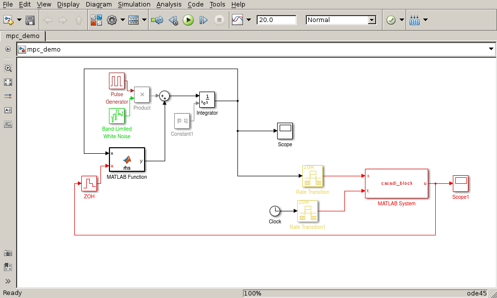
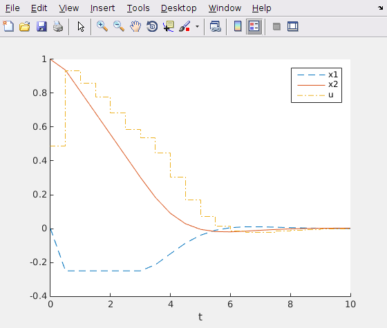
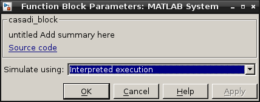
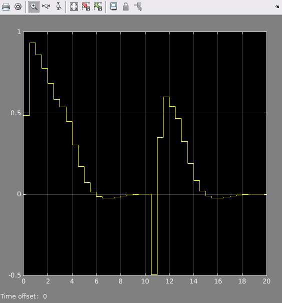
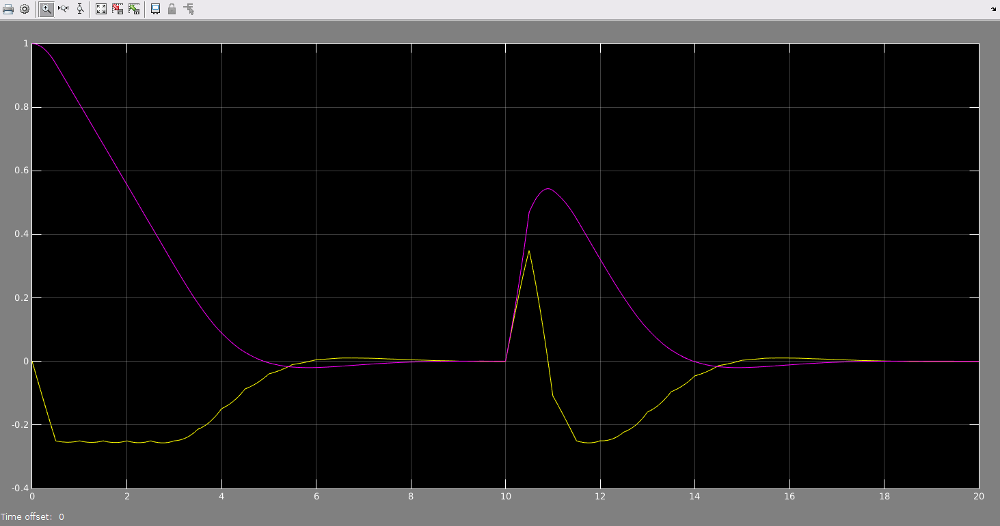

CasADi is not a monolithic tool. We can easily couple it to other software to have more fun.
Today we'll be exploring a _simple_ coupling with Simulink. We'll be showing off nonlinear MPC (NMPC).

<!--more-->



# The details

For plant model, we'll be using the familiar [Van der Pol oscillator](https://en.wikipedia.org/wiki/Van_der_Pol_oscillator) ode:

$$
\frac{d\begin{bmatrix}x_1\\ x_2\end{bmatrix}}{dt} = \begin{bmatrix}(1-x_2^2)\, x_1-x_2+u\\ x_1\end{bmatrix}.
$$

In the above Simulink block diagram, the `rhs` MATLAB function block encodes this ode:
```matlab
function y = rhs(x,u)
  y = [(1-x(2)^2)*x(1) - x(2) + u; x(1)];
end
```

The `casadi_block` computes the discrete control signal by solving an Optimal Control Problem (OCP).
The act of closing the loop with the continuous plant makes our setup effectively an MPC controller.

The OCP problem here simply drives the states to zero:
$$
\begin{align}
  \displaystyle \underset{\begin{array}{c}x(\cdot), u(\cdot)\end{array}}
  {\text{minimize}}\quad &\displaystyle \int_{0}^{T}{ \left( x_1(t)^2 + x_2(t)^2 + u(t)^2 \right) \, dt} \\
  \text{subject to} \, \quad
  & \left\{
  \begin{array}{l}
    \dot{x}_1(t) = (1-x_2(t)^2) \, x_1(t) - x_2(t) + u(t) \\
    \dot{x}_2(t) = x_1(t) \\
    -1.0 \le u(t) \le 1.0, \quad x_1(t) \ge -0.25
  \end{array}
  \right. \quad  t \in [0,T] \\
  & x_1(0)=\bar{x}_1, \quad x_2(0)=\bar{x}_2
\end{align}
$$

We will use the [multiple shooting transcription from the CasADi examples](https://github.com/casadi/casadi/blob/3.1.0/docs/examples/matlab/direct_multiple_shooting.m) to cast the OCP to an NLP problem. In short, the multiple shooting code reads like:
```matlab
w = {}; % decision variables
g = {}; % cosntraints
J = 0; % objective

% Initial conditions
X0 = MX.sym('X0', 2);

% Formulate the NLP
Xk = X0;
for k=0:N-1
    % New NLP variable for the control
    Uk = MX.sym('U');
    w = {w{:}, Uk};

    % Integrate till the end of the interval
    Fk = F('x0', Xk, 'p', Uk);
    Xk_end = Fk.xf;
    J=J+Fk.qf;

    % New NLP variable for state at end of interval
    Xk = MX.sym('X', 2);
    w = {w{:}, Xk};

    % Add equality constraint
    g = {g{:}, Xk_end-Xk};
end

% Create an NLP solver
prob = struct('f', J, 'x', vertcat(w{:}), 'g', vertcat(g{:}));
solver = nlpsol('solver', 'ipopt', prob);
```

Recall from that example the solution plot:

.

As we all know, CasADi makes an important distinction between _initialisation_ and _evaluation_ steps.
We would not want to construct an NLP afresh at every sampling time!
Rather, we'd like to construct the NLP once, and simply evaluate it repeatedly using slightly different numerical inputs.
For this purpose, we chose a `MATLAB System` block in Simulink.

In abbreviated form, the code in that block reads:
```matlab
classdef casadi_block < matlab.System
    properties (Access = private)
        casadi_solver
        lbx
        ubx
    end
    methods (Access = protected)
        function setupImpl(obj,~,~)
            obj.casadi_solver = nlpsol('solver', 'ipopt', prob, options);
            obj.lbx = lbw;
            obj.ubx = ubw;
        end

        function u = stepImpl(obj,x,t)
            lbw = obj.lbx;
            ubw = obj.ubx;
            solver = obj.casadi_solver;
            lbw(1:2) = x;
            ubw(1:2) = x;
            sol = solver('x0', w0, 'lbx', lbw, 'ubx', ubw,...
                        'lbg', obj.lbg, 'ubg', obj.ubg);

            u = full(sol.x(3));
        end

    end
end
```

As you can see, `setupImpl` takes care of constructing the NLP, and `stepImpl` solves the actual NLP while constraining $x_1(0)$ and $x_2(0)$ to the state _measurement_ coming in from Simulink.


In general, you may distinguish several approaches to bring CasADi computations into simulink:
 1. write CasADi-Matlab code, and use an `interpreted Matlab code` in Simulink
 2. write CasADi-Matlab code, and use CasADi's codegenerator to spit out a pure c function (or mex file). Then, interface that pure c function in simulink
 3. write a mex file from scratch using CasADi-C++ code

We used option 1 here. It's the most simple way. Obviously this is not the most efficient way,
but since all of CasADi's number-crunching happens in compiled libraries, `interpreted Matlab code` is not as bad as it sounds perhaps.
Anyway, make sure that you indicate to Simulink that the code is `interpreted`:



Let's jump to results.

# The results
MPC control signal:


State evolution:


Note how the control trajectory (up to t=10s) matches the reference solution further up in this post.
The state trajectory matches too, but Simulink shows you more detail: you see the smooth time-evolution of the system in-between the sampling times.
Pretty neat, huh?
Just for fun, I dropped in some noised at around t=10s. The MPC controller manages to recover from this.

This post showed a quick way to drop your CasADi code into Simulink.
We're curious what you'll cook up based on this example. Enjoy!

Downloads: [casadi_block.m](casadi_block.m), [mpc_demo.slx](mpc_demo.slx)
