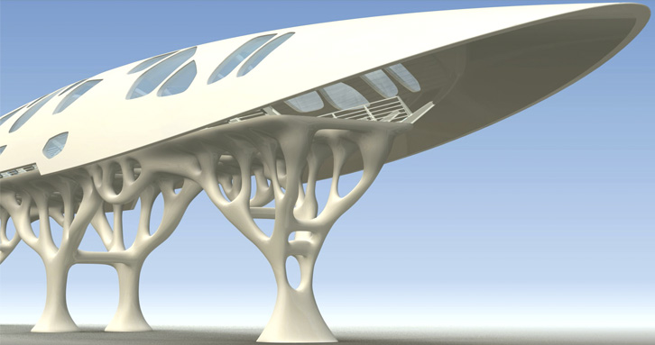
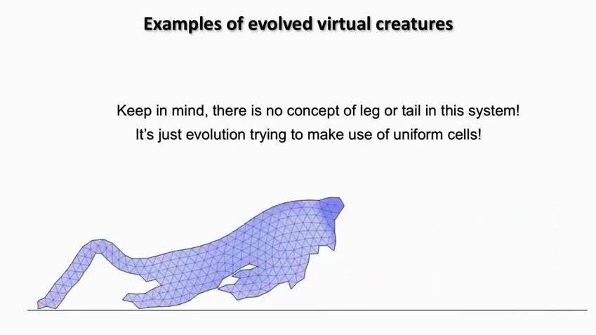
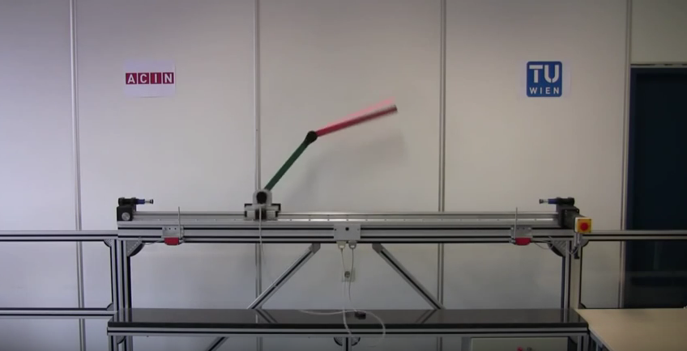
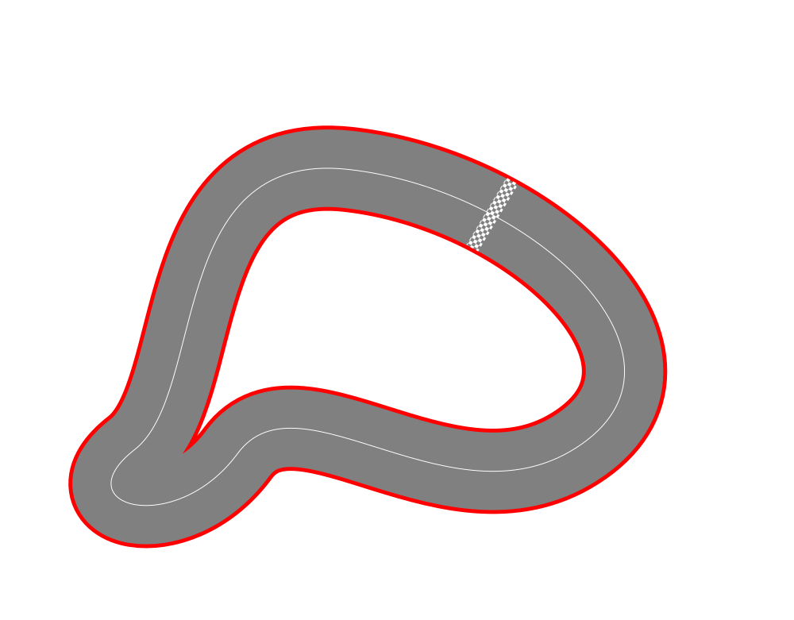
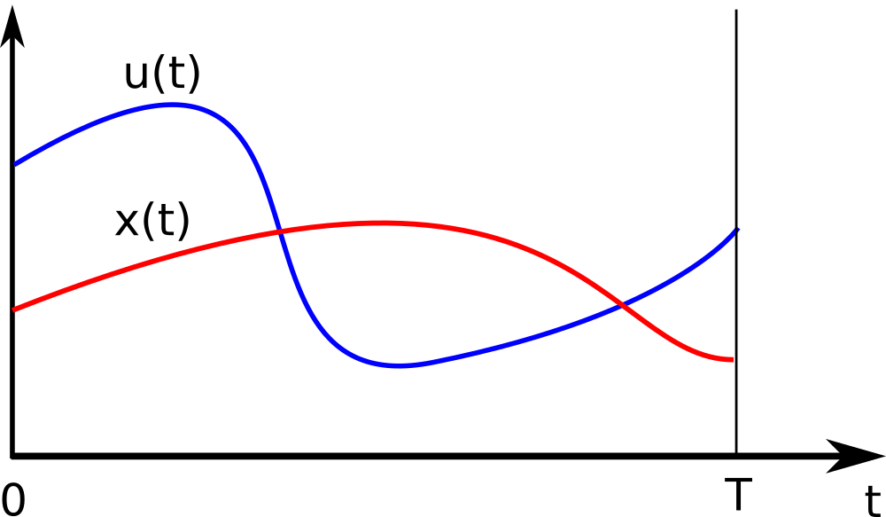
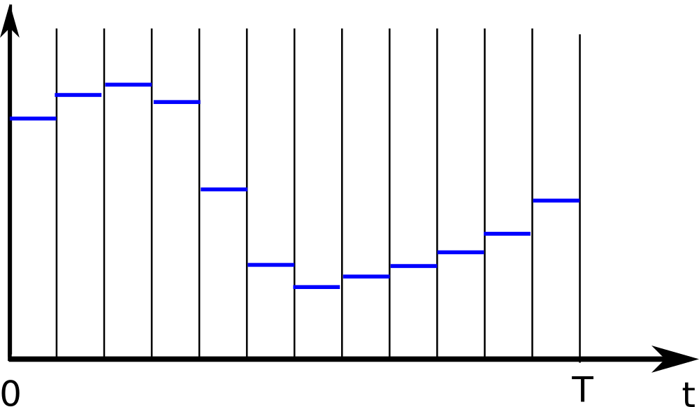
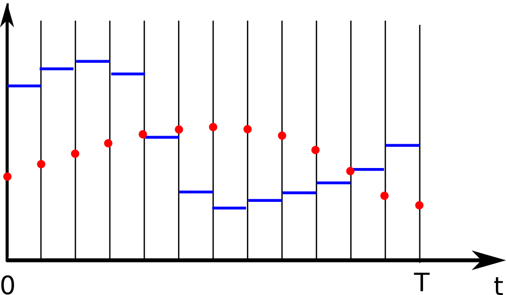
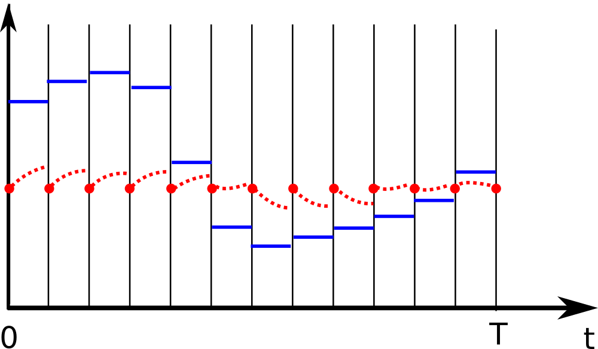
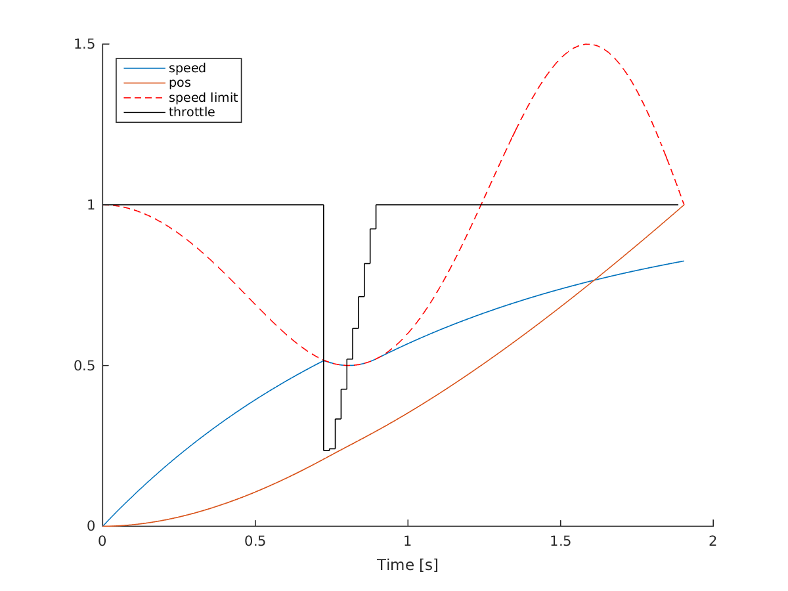
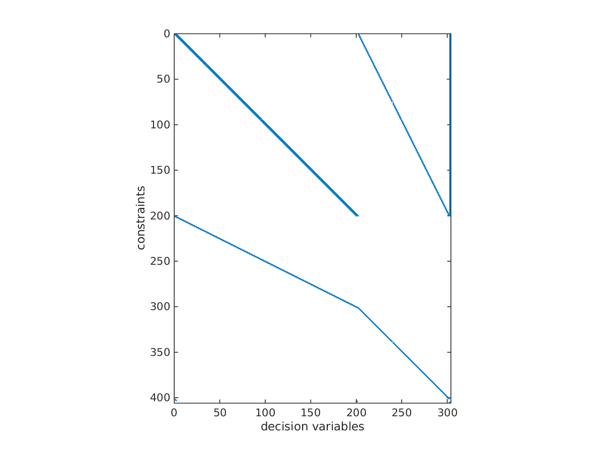

Optimization.
There's a mathematical term that sounds familiar to the general public.
Everyone can imagine engineers working hard to make your car run 1% more fuel-efficient,
or to slightly increase profit margins for a chemical company.

<!--more-->

That sounds rather dull; an icing on the cake at best.
Optimization can be more than this. I'd argue that optimization can deliver intelligence or creativity.

Consider that finding your next chess move amounts to optimization. Consider the results of [topology optimization](http://www.altairhyperworks.com/industry/Architecture)
,
or [evolving artificial life](https://youtu.be/CXTZHHQ7ZiQ?t=1m5s):


Our field of research is optimal control, in which we seek time-trajectories for control signals that make a dynamic system carry out a task in an optimal way.

In many cases, like for a [double pendulum swing-up](https://youtu.be/B6vr1x6KDaY?t=5s)

the most exciting part of optimal control is not that it can spot the optimum out of many valid trajectories.
It's that it can find valid trajectories at all, out of the blue.

# Slot car racing problem

Let's get concrete and solve an actual optimal control problem, using CasADi.
We will go racing a toy slot car.



The task is to finish 1 lap as fast as possible, starting from standstill.
Go too fast, and the car will fly out of its slot.
There is just one way to control the system: pick the amount of throttle $u(t)$ at any give time.

First, we encode the knowledge we have about the system dynamics in a differential equation (ODE):

$$
\frac{d \begin{bmatrix} p(t) \\ v(t) \end{bmatrix}}{dt} = \begin{bmatrix} v(t) \\ u(t)-v(t) \end{bmatrix},
$$
where $p(t)$ is position and $v(t)$ is speed.

Summarizing the system states in one vector $x(t) = [p(t);v(t)]$, we have:
$$
\dot{x}(t) = f(x(t),u(t)).
$$

Next, we encode the the task definition in a continuous-time optimal control problem (OCP).

$$
\begin{align}
  \displaystyle \underset{\begin{array}{c}x(\cdot), u(\cdot)\end{array}}
  {\text{minimize}}\quad &\displaystyle T \\
  \text{subject to} \, \quad
  & \dot{x}(t) = f(x(t),u(t)) \quad  t \in [0,T], & \textrm{dynamic constraints} \\
  & p(0) = 0, & \textrm{boundary condition: start at position 0}  \\
  & v(0) = 0, & \textrm{boundary condition: start with zero speed}\\
  & p(T) = 1, & \textrm{boundary condition: the finish line is at position 1}\\
  & 0 \leq u(t) \leq 1, & \textrm{path constraint: throttle is limited} \\
  & v(t) \leq L(p(t)). & \textrm{path constraint: speed limit varying along the track} \\
\end{align}
$$

Note our decision variables $x(\cdot)$ and $u(\cdot)$: the result of the optimization should be functions, i.e. infinitely detailed descriptions of how the states and control should move over time from $0$ to $T$:



# Multiple-shooting

Computers don't like infinities. Therefore, let's discretize the problem in time.
Choose a number $N$ of control intervals in which the control effort is kept constant:



We now have decision variables $u_1,u_2,\ldots,u_{N}$ instead of function $u(\cdot)$.

For the state trajectory, let's consider the states at the boundaries of each control interval:


We now have decision variables $x_1,x_2,\ldots,x_{N+1}$ instead of function $x(\cdot)$.

In each control interval $k$, we now have a start state $x_k$ and a fixed control signal $u_k$.
Over this interval, we may perform a time integration of our ODE.
For example, using explicit euler: $x_{k+1} \approx x_{k} + \frac{T}{N} f(x_k,u_k)$, in general:

$$
x_{k+1} = F(x_k,u_k).
$$

For each interval the integrator predicts were our system will end up at the end of that interval.
Starting our numerical optimization with putting all states at a constant location, the picture may look like:



We notice gaps here; there's a mismatch between were the integrator says we will end up and where our state decision variables think we are.
What we do is add constraints that make the gap zero.

The result is a multiple-shooting transcription of the original OCP:

$$
\begin{align}
  \displaystyle \underset{u_1,u_2,\ldots,u_{N},x_1,x_2,\ldots,x_{N+1}}
  {\text{minimize}}\quad &\displaystyle T \\
  \text{subject to} \, \quad
  & x_{k+1} = F(x_k,u_k) \quad  k=1 \ldots N, & \textrm{dynamic constraints a.k.a. gap closing} \\
  & p_1 = 0, & \textrm{boundary condition: start at position 0}  \\
  & v_1 = 0, & \textrm{boundary condition: start with zero speed}\\
  & p_{N+1} = 1, & \textrm{boundary condition: the finish line is at position 1}\\
  & 0 \leq u_k \leq 1, \quad  k=1 \ldots N , & \textrm{path constraint: throttle is limited} \\
  & v_k \leq L(p_k). \quad  k=1 \ldots N+1 & \textrm{path constraint: speed limit varying along the track} \\
\end{align}
$$

# Coding

Let's get coding, using CasADi's [Opti]() functionality.

Set up the problem
```matlab
N = 100; % number of control intervals

opti = casadi.Opti(); % Optimization problem
```

Declare decision variables.

```matlab
X = opti.variable(2,N+1); % state trajectory
pos   = X(1,:);
speed = X(2,:);
U = opti.variable(1,N);   % control trajectory (throttle)
T = opti.variable();      % final time
```

Set the objective.
```matlab
opti.minimize(T); % race in minimal time
```

Specify system dynamics.
```matlab
f = @(x,u) [x(2);u-x(2)]; % dx/dt = f(x,u)
```

Create gap closing constraints, picking Runge-Kutta as integration method.

```matlab
dt = T/N; % length of a control interval
for k=1:N % loop over control intervals
   % Runge-Kutta 4 integration
   k1 = f(X(:,k),         U(:,k));
   k2 = f(X(:,k)+dt/2*k1, U(:,k));
   k3 = f(X(:,k)+dt/2*k2, U(:,k));
   k4 = f(X(:,k)+dt*k3,   U(:,k));
   x_next = X(:,k) + dt/6*(k1+2*k2+2*k3+k4);
   opti.subject_to(X(:,k+1)==x_next); % close the gaps
end
```

Set path constraints.
```matlab
limit = @(pos) 1-sin(2*pi*pos)/2;
opti.subject_to(speed<=limit(pos)); % track speed limit
opti.subject_to(0<=U<=1);           % control is limited
```

Set boundary conditions.
```matlab
opti.subject_to(pos(1)==0);   % start at position 0 ...
opti.subject_to(speed(1)==0); % ... from stand-still
opti.subject_to(pos(N+1)==1); % finish line at position 1
```

One extra constraint.
```matlab
opti.subject_to(T>=0); % Time must be positive
```

Provide initial guesses for the solver:
```matlab
opti.set_initial(speed, 1);
opti.set_initial(T, 1);
```

Solve the NLP using IPOPT

```matlab
opti.solver('ipopt'); % set numerical backend
sol = opti.solve();   % actual solve
```


Post processing of the optimal values.
```matlab
plot(sol.value(speed));
plot(sol.value(pos));
```


The solution is intuitive: we give 100% throttle, until we hit the speed limit. Next, we gradually inrease throttle again as the speed limit is raised.


A characteristic of the multiple-shooting approach is that there are many optimization variables (much more than in single-shooting),
but there is a lot of sparsity in the problem.

Indeed, have a look at the sparsity of the constraint Jacobian:
```matlab
spy(sol.value(jacobian(opti.g,opti.x)))
```




This structure is automatically detected and exploited by CasADi.


Download code: [race_car.m](race_car.m)
